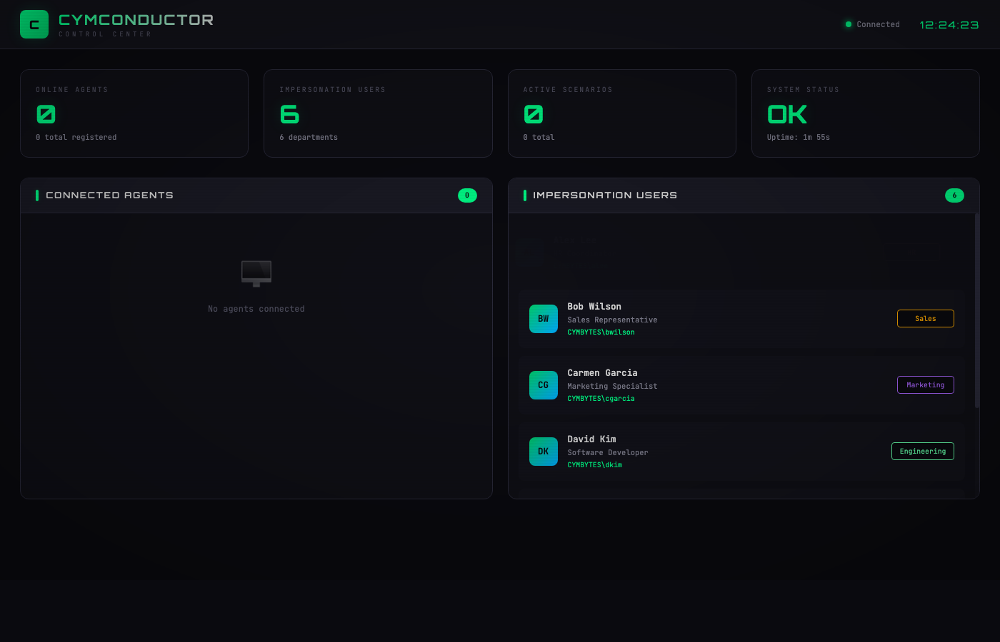

# CymConductor

Distributed orchestration system for automated lab activity simulation in CymBytes virtual laboratory environments.

## Overview

CymConductor consists of two components:

1. **Orchestrator** - Central "brain" running on the router VM that:
   - Manages agent registration and health
   - Accepts scenario intents (natural language or DSL)
   - Uses AI (Claude) to generate activity scenarios
   - Validates and compiles scenarios into discrete jobs
   - Dispatches jobs to appropriate agents

2. **Agent** - Lightweight binary running on lab VMs that:
   - Registers with the orchestrator
   - Polls for assigned jobs via heartbeat
   - Executes predefined noise actions from a finite catalog
   - Reports job completion status

## Security Model

The system enforces strict security boundaries:

```
Intent (NL/DSL) → AI Planner → Validator → Compiler → Jobs → Agent (catalog only)
                     ↑                                           ↓
              Orchestrator only                          4 predefined actions
```

- **AI runs ONLY in the orchestrator** - agents never execute AI-generated code
- **Agents execute from finite catalog** - only 4 predefined action types are allowed
- **No LLM → shell path** - all actions have fixed implementations
- **Strict validation** - DSL is validated before compilation

## Noise Action Catalog

Agents can execute exactly these action types:

| Action | Description |
|--------|-------------|
| `simulate_browsing` | Navigate to URLs, submit forms |
| `simulate_file_activity` | Create, read, modify files |
| `simulate_email_traffic` | Connect to mail servers, send/receive |
| `simulate_process_activity` | Launch approved processes |

## Architecture

```
┌─────────────────────────────────────────────────────────────────────┐
│                         Router VM (10.255.255.254)                  │
│  ┌───────────────────────────────────────────────────────────────┐  │
│  │                    lab-orchestrator container                 │  │
│  │  ┌─────────┐  ┌──────────┐  ┌───────────┐  ┌───────────────┐ │  │
│  │  │   API   │  │ Registry │  │ Scheduler │  │  AI Planner   │ │  │
│  │  │ :8081   │  │          │  │           │  │   (Claude)    │ │  │
│  │  └────┬────┘  └────┬─────┘  └─────┬─────┘  └───────────────┘ │  │
│  │       │            │              │                           │  │
│  │       └────────────┴──────────────┴──────────────────────────┐│  │
│  │                         SQLite DB                             │  │
│  └───────────────────────────────────────────────────────────────┘  │
└───────────────────────────────────────────────────────────────────┬─┘
                                                                    │
                    HTTP Polling (every 5s)                         │
                                                                    │
    ┌───────────────────────────────────────────────────────────────┼───┐
    │                    Lab Network (10.255.255.0/24)              │   │
    │                                                               ▼   │
    │  ┌─────────────────┐  ┌─────────────────┐  ┌─────────────────┐   │
    │  │   Windows VM    │  │   Windows VM    │  │    Linux VM     │   │
    │  │  (Workstation)  │  │ (Domain Ctrl)   │  │    (Server)     │   │
    │  │   cymbytes-     │  │   cymbytes-     │  │   cymbytes-     │   │
    │  │   agent.exe     │  │   agent.exe     │  │   agent         │   │
    │  │                 │  │                 │  │                 │   │
    │  │ labels:         │  │ labels:         │  │ labels:         │   │
    │  │  role:workstation│  │  role:dc       │  │  role:server    │   │
    │  │  os:windows     │  │  os:windows    │  │  os:linux       │   │
    │  └─────────────────┘  └─────────────────┘  └─────────────────┘   │
    └───────────────────────────────────────────────────────────────────┘
```

## Web Dashboard

CymConductor includes a real-time web dashboard for monitoring:

- **Online Agents** - Connected lab hosts and their status
- **Impersonation Users** - Configured user personas by department
- **Active Scenarios** - Running activity simulations
- **System Health** - Orchestrator status and uptime

Access the dashboard at `http://<orchestrator>:8081/`



## Quick Start with Docker

```bash
# Run the orchestrator
docker run -d \
  --name cymconductor \
  -p 8081:8081 \
  -v cymconductor-data:/data \
  cymconductor:latest

# Seed users
cat configs/seed-users.json | curl -X POST http://localhost:8081/api/users/bulk \
  -H "Content-Type: application/json" -d @-

# Access the dashboard
open http://localhost:8081
```

## Building

### Prerequisites

- Go 1.21+
- Docker (for container builds)
- Make

### Build Commands

```bash
# Build all binaries
make build

# Build orchestrator only
make build-orchestrator

# Build agents only
make build-agents

# Build Docker image
make docker

# Run tests
make test

# Clean build artifacts
make clean
```

### Cross-Compilation

The Makefile produces binaries for all target platforms:

```
bin/
├── orchestrator-linux-amd64      # For router container
├── agent-linux-amd64             # For Linux lab VMs
└── agent-windows-amd64.exe       # For Windows lab VMs
```

## Configuration

### Orchestrator Configuration

```yaml
# configs/orchestrator.yaml
server:
  host: "0.0.0.0"
  port: 8081
  read_timeout: 30s
  write_timeout: 30s
  downloads_dir: "/srv/downloads"
  web_dir: "/srv/web"

database:
  path: "/data/orchestrator.db"
  max_open_conns: 10
  max_idle_conns: 5
  enable_wal: true

registry:
  heartbeat_timeout: "30s"
  cleanup_interval: "60s"

scheduler:
  poll_interval: "1s"
  max_jobs_per_agent: 5

azure:
  key_vault_url: "https://kv-cymbytes-prod.vault.azure.net/"
  api_key_secret_name: "anthropic-api-key"

logging:
  level: "info"
  format: "json"

intents:
  watch_directory: "/opt/labs/orchestrator/intents"
  poll_interval: "10s"
```

### Agent Configuration

```yaml
# configs/agent.yaml
orchestrator:
  url: "http://10.0.0.254:8081"
  connect_timeout: 10s
  request_timeout: 30s

agent:
  id: ""  # Auto-generated if empty
  lab_host_id: ""
  hostname: ""  # Auto-detected if empty
  labels:
    role: "workstation"
    os: "windows"

heartbeat:
  interval: 5s
  max_jobs_per_poll: 3

actions:
  browsing:
    browser_path: "C:\\Program Files\\Google\\Chrome\\Application\\chrome.exe"
    user_data_dir: "C:\\ProgramData\\CymBytes\\chrome-profile"

  file_activity:
    allowed_directories:
      - "C:\\Users\\cbadmin\\Documents"
      - "C:\\Users\\cbadmin\\Desktop"

  process_activity:
    allowed_processes:
      - "notepad.exe"
      - "calc.exe"
      - "mspaint.exe"

logging:
  level: "info"
  format: "json"
  path: "C:\\ProgramData\\CymBytes\\logs\\agent.log"
```

## API Reference

### Agent Endpoints

| Method | Endpoint | Description |
|--------|----------|-------------|
| POST | `/api/agents/register` | Register new agent |
| POST | `/api/agents/:id/heartbeat` | Heartbeat + poll for jobs |
| POST | `/api/agents/:id/jobs/:jobId/result` | Submit job result |

### Scenario Endpoints

| Method | Endpoint | Description |
|--------|----------|-------------|
| POST | `/api/scenarios` | Submit scenario DSL |
| GET | `/api/scenarios/:id` | Get scenario status |
| GET | `/api/scenarios/:id/jobs` | List jobs for scenario |

### Intent Endpoints

| Method | Endpoint | Description |
|--------|----------|-------------|
| POST | `/api/intents` | Submit natural language intent |

### Impersonation Users

| Method | Endpoint | Description |
|--------|----------|-------------|
| GET | `/api/users` | List all users |
| POST | `/api/users` | Create user |
| POST | `/api/users/bulk` | Bulk create users |
| GET | `/api/users/:id` | Get user details |
| PUT | `/api/users/:id` | Update user |
| DELETE | `/api/users/:id` | Delete user |

### Health Check

| Method | Endpoint | Description |
|--------|----------|-------------|
| GET | `/health` | Orchestrator health status |

## DSL Specification

Scenarios are defined using a structured DSL:

```yaml
name: "Morning Office Activity"
description: "Simulate typical morning office workflow"
version: "1.0"

schedule:
  type: "one_time"  # or "recurring"
  start_at: "2025-01-15T09:00:00Z"

steps:
  - name: "Check email"
    action:
      type: "simulate_browsing"
      params:
        urls:
          - "https://outlook.office365.com"
        actions:
          - type: "navigate"
            url: "https://outlook.office365.com"
          - type: "wait"
            duration: "5s"
    target:
      labels:
        role: "workstation"
    timing:
      delay: "0s"
      timeout: "60s"

  - name: "Open documents"
    action:
      type: "simulate_file_activity"
      params:
        operations:
          - type: "read"
            path: "C:\\Users\\cbadmin\\Documents\\report.docx"
          - type: "create"
            path: "C:\\Users\\cbadmin\\Documents\\notes.txt"
            content: "Meeting notes for today..."
    target:
      labels:
        role: "workstation"
    timing:
      delay: "30s"
      timeout: "30s"
```

## Deployment

### Ansible Deployment (Recommended)

The orchestrator is deployed via Ansible role in the router repository:

```bash
# Enable orchestrator deployment
cd ubuntu-server-22-lts-prepared-router-master

# Edit inventory to enable orchestrator
echo "deploy_orchestrator: true" >> ansible/inventory/group_vars/router.yml

# Deploy
afb exec ansible-playbook playbook.yml -vv --tags orchestrator
```

### Manual Docker Deployment

```bash
# Build image
docker build -t cymbytes/orchestrator:latest .

# Run container
docker run -d \
  --name lab-orchestrator \
  --network host \
  -e AZURE_KEY_VAULT_URL="https://kv-cymbytes-prod.vault.azure.net/" \
  -e LOG_LEVEL=info \
  -v /opt/labs/orchestrator/config:/etc/orchestrator:ro \
  -v /opt/labs/orchestrator/data:/data:rw \
  -v /opt/labs/orchestrator/intents:/opt/labs/orchestrator/intents:ro \
  cymbytes/orchestrator:latest
```

### Agent Installation

**Windows:**
```powershell
# Download agent
Invoke-WebRequest -Uri "http://10.255.255.254:8081/downloads/agent-windows-amd64.exe" `
  -OutFile "C:\ProgramData\CymBytes\cymbytes-agent.exe"

# Create config
# Copy configs/agent.yaml to C:\ProgramData\CymBytes\agent.yaml

# Install as service
sc create CymBytesAgent binpath="C:\ProgramData\CymBytes\cymbytes-agent.exe" start=auto
sc start CymBytesAgent
```

**Linux:**
```bash
# Download agent
curl -o /opt/cymbytes/agent http://10.255.255.254:8081/downloads/agent-linux-amd64
chmod +x /opt/cymbytes/agent

# Create config
# Copy configs/agent.yaml to /etc/cymbytes/agent.yaml

# Run
/opt/cymbytes/agent -config /etc/cymbytes/agent.yaml
```

## Directory Structure

```
cymconductor/
├── cmd/
│   ├── orchestrator/          # Orchestrator entry point
│   │   └── main.go
│   └── agent/                 # Agent entry point
│       └── main.go
├── internal/
│   ├── orchestrator/
│   │   ├── api/               # HTTP server and handlers
│   │   │   ├── server.go
│   │   │   └── handlers/
│   │   │       └── handlers.go
│   │   ├── storage/           # SQLite persistence
│   │   │   ├── sqlite.go
│   │   │   ├── agents.go
│   │   │   ├── jobs.go
│   │   │   └── scenarios.go
│   │   ├── registry/          # Agent registry
│   │   │   └── registry.go
│   │   ├── scheduler/         # Job dispatcher
│   │   │   └── scheduler.go
│   │   ├── validator/         # DSL validation
│   │   │   └── validator.go
│   │   ├── compiler/          # DSL to jobs
│   │   │   └── compiler.go
│   │   └── planner/           # AI integration
│   │       ├── planner.go
│   │       ├── client.go
│   │       └── prompts.go
│   └── agent/
│       ├── client/            # Orchestrator API client
│       │   └── client.go
│       ├── executor/          # Job executor
│       │   └── executor.go
│       └── actions/           # Action implementations
│           ├── registry.go
│           ├── browsing.go
│           ├── file_activity.go
│           ├── process_activity.go
│           └── email_traffic.go
├── pkg/
│   ├── dsl/                   # DSL types
│   │   ├── actions.go
│   │   └── scenario.go
│   └── protocol/              # Shared API types
│       ├── requests.go
│       └── responses.go
├── migrations/                # Database migrations
│   └── 001_initial_schema.sql
├── configs/                   # Example configurations
│   ├── orchestrator.yaml
│   └── agent.yaml
├── Dockerfile
├── Makefile
└── go.mod
```

## Development

### Running Locally

```bash
# Start orchestrator
./bin/orchestrator-linux-amd64 -config configs/orchestrator.yaml

# In another terminal, start agent
./bin/agent-linux-amd64 -config configs/agent.yaml
```

### Testing

```bash
# Run all tests
make test

# Run with coverage
go test -cover ./...

# Run specific package tests
go test ./internal/orchestrator/validator/...
```

### API Testing

```bash
# Register agent
curl -X POST http://localhost:8081/api/agents/register \
  -H "Content-Type: application/json" \
  -d '{
    "hostname": "workstation1",
    "lab_host_id": "ws1",
    "labels": {"role": "workstation", "os": "windows"},
    "capabilities": ["browsing", "file_activity"]
  }'

# Submit scenario
curl -X POST http://localhost:8081/api/scenarios \
  -H "Content-Type: application/json" \
  -d @scenario.yaml

# Check health
curl http://localhost:8081/health
```

## Troubleshooting

### Orchestrator not starting

1. Check Docker container logs: `docker logs lab-orchestrator`
2. Verify Azure Key Vault URL is correct
3. Check database path is writable

### Agent not registering

1. Verify orchestrator URL is reachable: `curl http://10.255.255.254:8081/health`
2. Check firewall allows port 8081 from agent network
3. Review agent logs for connection errors

### Jobs not executing

1. Check agent labels match scenario targets
2. Verify agent has required capabilities
3. Check job status in orchestrator: `GET /api/scenarios/:id/jobs`

## License

Proprietary - CymBytes. All rights reserved.

## Attribution

See SOURCES.md for public source attribution.
